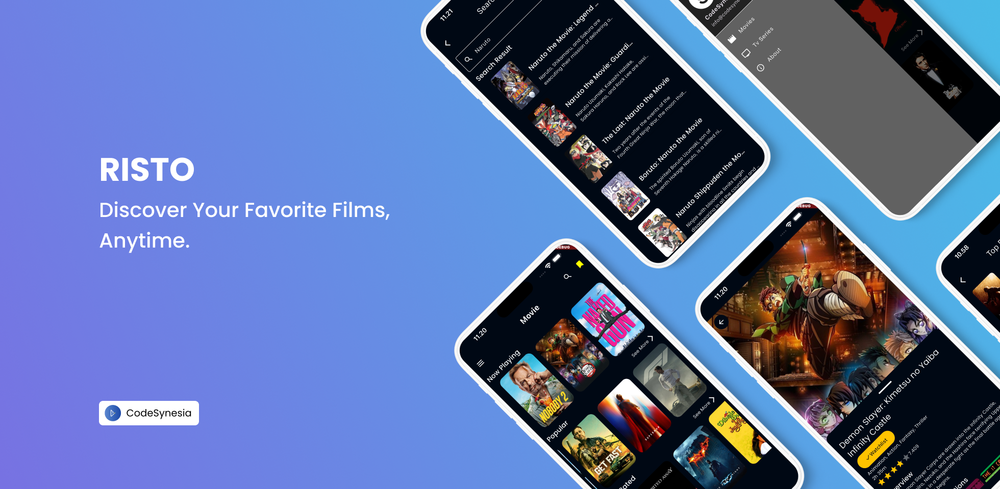
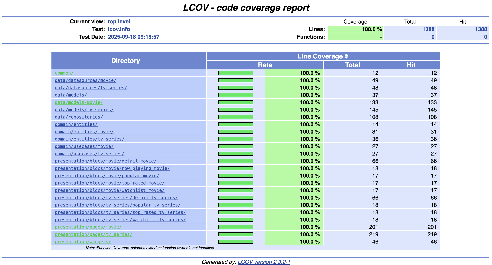
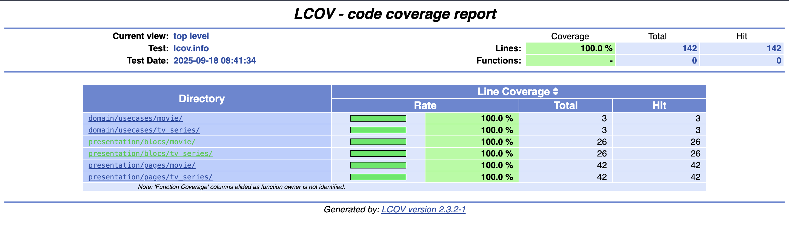
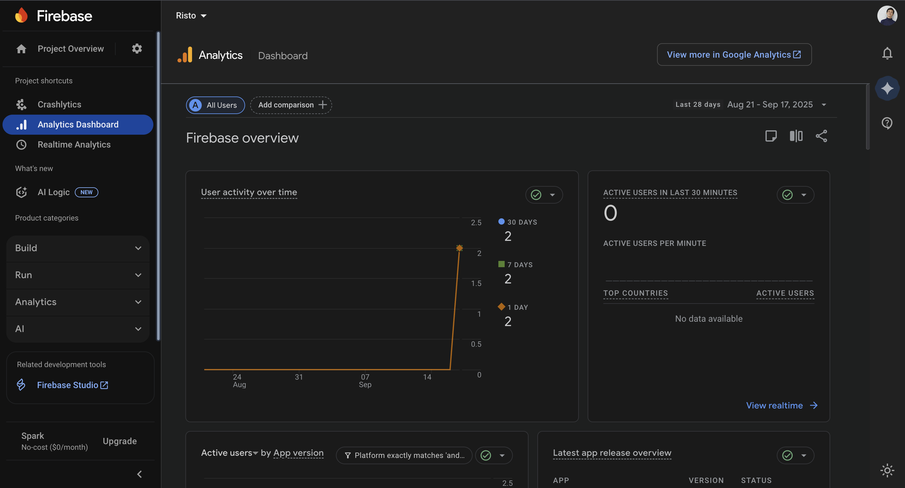
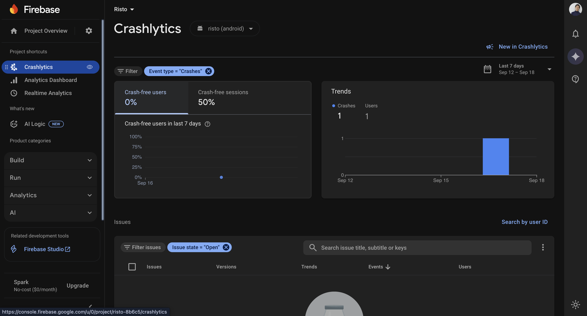

# Risto

<br />

[](README_EN.md)[](README.md) []([README_EN.md](https://codemagic.io/app/68c9aea497fe1c526b443cc5/68c9aea497fe1c526b443cc4/latest_build))


**Risto** is a movie and TV series catalog application built with Flutter. It offers a clean and responsive user interface that allows users to:

- Explore a wide range of movies and TV shows across different genres

- Quickly search for their favorite titles

- Save and manage a personalized watchlist

Designed to deliver a seamless user experience, **Risto** is perfect for anyone looking to stay organized with their entertainment. This project can also serve as a reference for Flutter developers interested in learning about modern app architecture, state management, and efficient API integration.

## ✨ Key Features

### 🎥 Movies
- **Now Playing Movies** - Currently playing movies
- **Popular Movies** - Popular movies
- **Top Rated Movies** - Highest rated movies
- **Movie Detail** - Complete movie details including synopsis, rating, and recommendations
- **Search Movies** - Search movies by title
- **Watchlist Movies** - List of movies to watch (stored locally)

### 📺 TV Series
- **Now Playing TV Series** - Currently airing TV series
- **Popular TV Series** - Popular TV series
- **Top Rated TV Series** - Highest rated TV series
- **TV Series Detail** - Complete TV series details including synopsis, rating, and recommendations
- **Search TV Series** - Search TV series by title
- **Watchlist TV Series** - List of TV series to watch (stored locally)

### 🔍 Additional Features
- **Dark Theme** - Dark theme for comfortable visual experience
- **Offline Support** - Watchlist data stored locally using SQLite
- **Rating Display** - Display movie/series ratings using rating bar
- **Responsive Design** - Responsive display for various screen sizes

## 📱 Screenshots

<details>
<summary>Click to view application screenshots</summary>

### Movie & TV Series List


### Movie/TV Series Detail


### Popular Movie/TV Series


### Watchlist Movie/TV Series


### Menu/Drawer


### Search Movie/TV Series


### About


</details>

## 🏗️ Architecture

This application uses **Clean Architecture** with the following structure:

```
lib/
├── common/           # Common components (constants, exceptions, failures)
├── data/            # Data layer
│   ├── datasources/ # Remote & Local data sources
│   ├── models/      # Data models
│   └── repositories/ # Repository implementations
├── domain/          # Domain layer
│   ├── entities/    # Business entities
│   ├── repositories/ # Repository contracts
│   └── usecases/    # Business logic
├── presentation/    # Presentation layer
│   ├── pages/       # UI screens
│   ├── provider/    # State management
│   └── widgets/     # Reusable widgets
└── injection.dart   # Dependency injection
```


## 🚀 How to Run the Application

### Prerequisites
- Flutter SDK ^3.9.2
- Dart SDK
- Android Studio / VS Code with Flutter extension
- Android device/emulator or iOS simulator

### Steps

1. **Clone repository**
   ```bash
   git clone https://github.com/bobipermanasandi/Risto.git
   cd risto
   ```

2. **Install dependencies**
   ```bash
   flutter pub get
   ```

3. **Generate mock files**
   ```bash
   dart run build_runner build --delete-conflicting-outputs
   ```

4. **Run application**
   ```bash
   flutter run
   ```

## 🧪 Testing

This application has comprehensive testing coverage:

### Running Tests
```bash
# Unit tests
flutter test

# Integration tests
flutter test integration_test/

# Tests with coverage
flutter test --coverage

# Generate to HTML
genhtml coverage/lcov.info -o coverage/html
```

### Coverage Report
After running tests with coverage, open the HTML file at:
```bash
open coverage/html/index.html
```

### Testing Structure
- **Unit Tests** - Testing for data sources, repositories, and use cases
- **Widget Tests** - Testing for UI components and pages
- **Integration Tests** - Testing for overall application flow

## 📱 Platform Support

The application supports multiple platforms:
- ✅ **Android**
- ✅ **iOS** 
- ✅ **Web**
- ✅ **Windows**
- ✅ **macOS**
- ✅ **Linux**

## 🔧 API Configuration

The application uses The Movie Database (TMDB) API:
```dart
// lib/common/constants.dart
const String apiKey = 'api_key=xxxxxxxx';
const String baseUrl = 'https://api.themoviedb.org/3';
```

## 📁 Main File Structure

```
lib/
├── main.dart                    # Application entry point
├── injection.dart              # Dependency injection setup
├── common/
│   ├── constants.dart          # App constants (API, colors, themes)
│   ├── exception.dart          # Custom exceptions
│   ├── failure.dart            # Failure classes
│   └── utils.dart              # Utility functions
├── data/
│   ├── datasources/            # Data sources (remote & local)
│   ├── models/                 # Data models
│   └── repositories/           # Repository implementations
├── domain/
│   ├── entities/               # Business entities
│   ├── repositories/           # Repository contracts
│   └── usecases/               # Business logic use cases
└── presentation/
    ├── pages/                  # UI screens
    ├── provider/               # State management
    └── widgets/                # Reusable widgets
```

## 🎨 UI/UX Features

- **Dark Theme** - Dark theme with attractive color combinations
- **Custom Colors** - Custom color palette with Google Fonts Poppins
- **Responsive Layout** - Responsive layout for various screen sizes
- **Smooth Navigation** - Smooth navigation with Cupertino and Material transitions
- **Loading States** - Loading indicators for good user experience

## 📊 Performance

- **Cached Images** - Using cached network image for loading optimization
- **Lazy Loading** - Implementing lazy loading for long lists
- **Local Storage** - Watchlist stored locally for offline access
- **Error Handling** - Comprehensive error handling with user-friendly messages

## 📱 Coverage & Firebase Report 

<details>
<summary>Click to view application screenshots</summary>

### Core Movie & TV Series


### Search Movie & TV Series


### Analytics


### Crashlytics


</details>

## 🤝 Contributing

1. Fork this repository
2. Create feature branch (`git checkout -b feature/AmazingFeature`)
3. Commit changes (`git commit -m 'Add some AmazingFeature'`)
4. Push to branch (`git push origin feature/AmazingFeature`)
5. Create Pull Request

## 📄 License

This project is created for educational purposes and to demonstrate Clean Architecture with Flutter.

